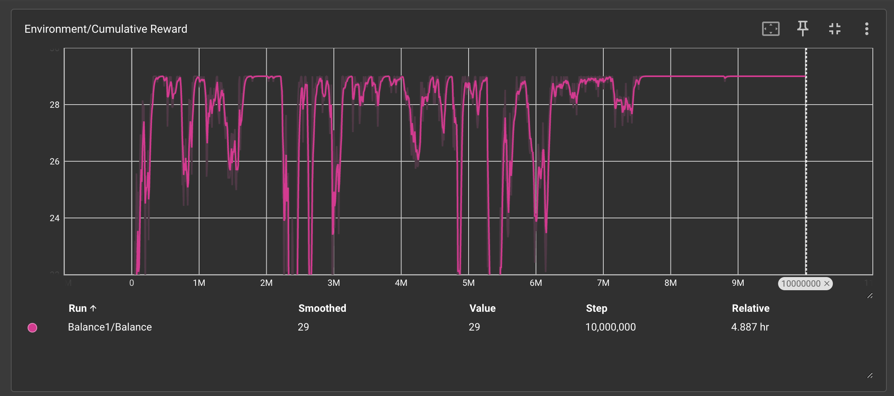
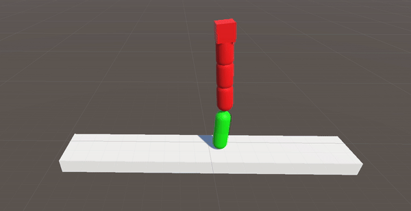
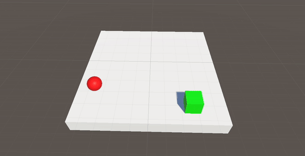

# Unity ML-Agents Experiments

Welcome to my collection of small reinforcement learning experiments using the [Unity ML-Agents Toolkit](https://github.com/Unity-Technologies/ml-agents) (based on PyTorch).

### Pros and Cons
- **Cons**: They're very simple.
- **Pros**: They probably won't steal your job.

### Repository with ML-Agents Toolkit:
[Unity-Technologies/ml-agents](https://github.com/Unity-Technologies/ml-agents)

### Installation Guide:
[Unity ML-Agents Installation](https://unity-technologies.github.io/ml-agents/Installation/)

I also highly recommend installing [TensorBoard](https://github.com/tensorflow/tensorboard/tree/master) to track your training process. While training, run the command from the root of the project:
```
tensorboard --logdir results
```

By default, TensorBoard will be accessible at [http://localhost:6006/](http://localhost:6006/)




## Examples


### Example 1: Balancing Act



**Set-up**: The agent (green) must balance a structure on its head.

**Algorithm**: [Proximal Policy Optimization (PPO)](https://en.wikipedia.org/wiki/Proximal_policy_optimization)

**Behavior Parameters**:
- **Observations**:
  - Agent's position on the X-axis
  - Top cube's position on the X-axis
  - Top cube's position on the Y-axis
- **Actions**:
  - 1 continuous action (-1 = Move left, 0 = do nothing, 1 = move right)

**Agent Reward Function**:
- -10 if the structure falls (end of episode)
- +1 every half second
- +10 if it stands for 10 seconds (end of episode)

---

### Example 2: Summation Wizard

**Set-up**: The agent learns to add two fractional numbers from 0 to 0.5 (yes, I know this is not really a Unity task, nor a reinforcement learning task, nor even an ML task, but hey).

**Algorithm**: [Proximal Policy Optimization (PPO)](https://en.wikipedia.org/wiki/Proximal_policy_optimization)

**Behavior Parameters**:
- **Observations**:
  - First number
  - Second number
- **Actions**:
  - 1 continuous action - the result of the sum

**Agent Reward Function**:
- 1 - abs(expectedSum - receivedSum)

---

### Example 3: Target Finder



**Set-up**: The agent must find a direct path to the target within 10 seconds. No extra rewards for quick finds.

**Algorithm**: [Proximal Policy Optimization (PPO)](https://en.wikipedia.org/wiki/Proximal_policy_optimization)

**Behavior Parameters**:
- **Observations**:
  - Target's position on X
  - Target's position on Y
  - Agent's position on X
  - Agent's position on Y
- **Actions**:
  - Movement on the X-axis (continuous action)
  - Movement on the Y-axis (continuous action)

**Agent Reward Function**:
- +1 if the target is close enough (end of episode)
- -1 if 10 seconds pass without finding the target (end of episode)
